适合初学同学练手项目，部署简单，代码简洁清晰；

愿世界和平再无bug

## 项目介绍

CRM是指客户关系管理系统 。该系统主要利用SpringBoot+LayUI实现，项目的核心模块包括基础模块、营销管理模块、权限管理模块、客户管理模块、服务管理和统计报表模块。除了对数据进行最基本的增删改查之外，该项目采用了RBAC实现权限认证，实现了用户关联角色、角色资源授权等功能。

## 技术栈

######    前端：vue| elementui

######      后端：springboot | mybatis

######      环境：jdk1.8+ | mysql | maven

## 设计说明

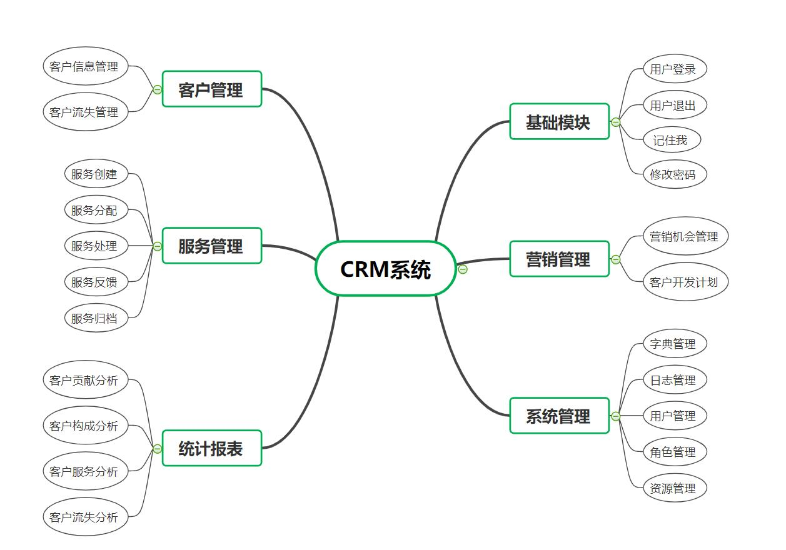

### 营销管理

*   营销机会管理：针对企业中客户的质询需求所建立的信息录入功能，方便销售人员进行后续的客户需求跟踪与联系，提高企业客户购买产品的几率。 
*   客户开发计划：对于系统录入每条营销机会记录，系统会分配对应的销售人员与对应的客户进行详细了解，从而提高客户开发计划的成功几率。对应到营销机会管理模块功能上。即:营销机会数据的录入，分配，修改，删除与查询等基本操作。

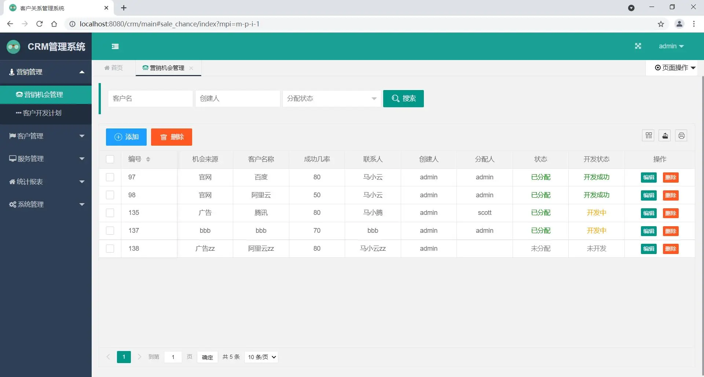

 

### 权限管理

RBAC是基于角色的访问控制（ Role-Based Access Control ）在RBAC中，权限与角色相关联，用户通过扮演适当的角色从而得到这些角色的权限。这样管理都是层级相互依赖的，权限赋予给角色，角色又赋予用户，这样的权限设计很清楚，管理起来很方便。

*   用户关联角色 

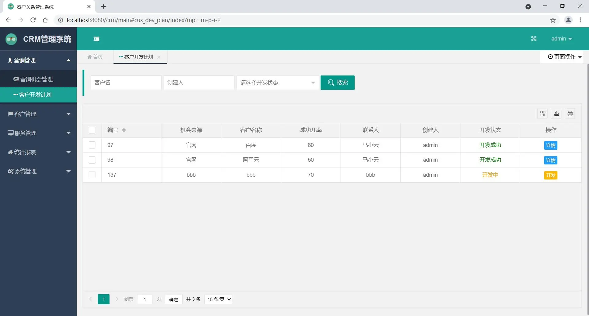

*   角色资源授权 

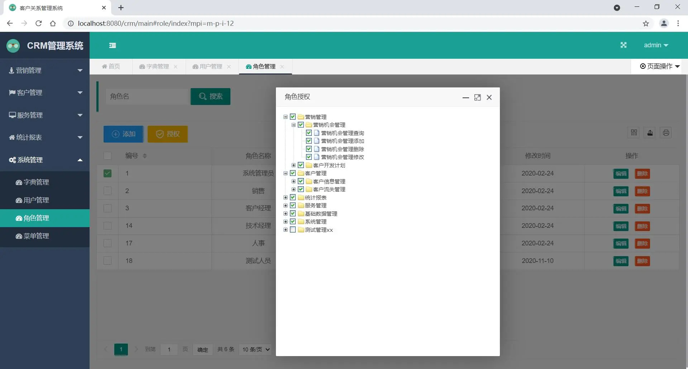

### 客户管理

*   客户信息维护：对客户信息的基本维护、订单查看等。 

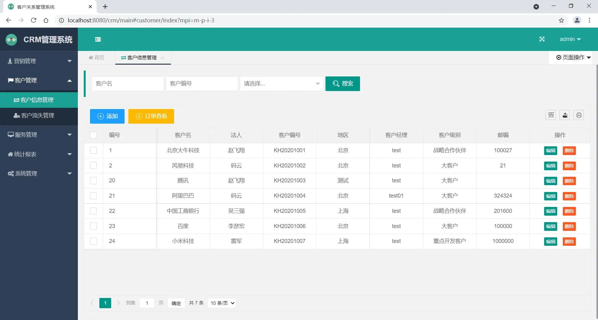

*   客户流失管理：对流失的客户信息进行维护、提供暂缓措施等。 

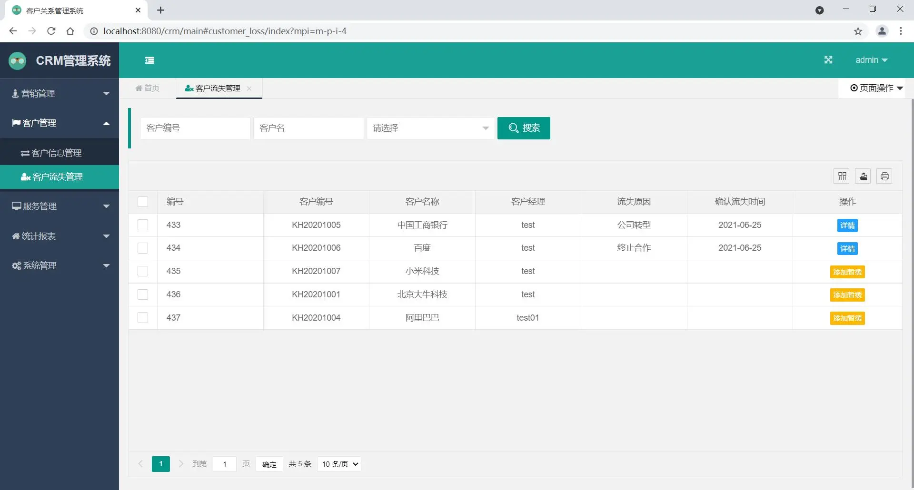

### 服务管理

*   服务创建 -> 服务分配 -> 服务处理 -> 服务反馈 -> 服务归档 

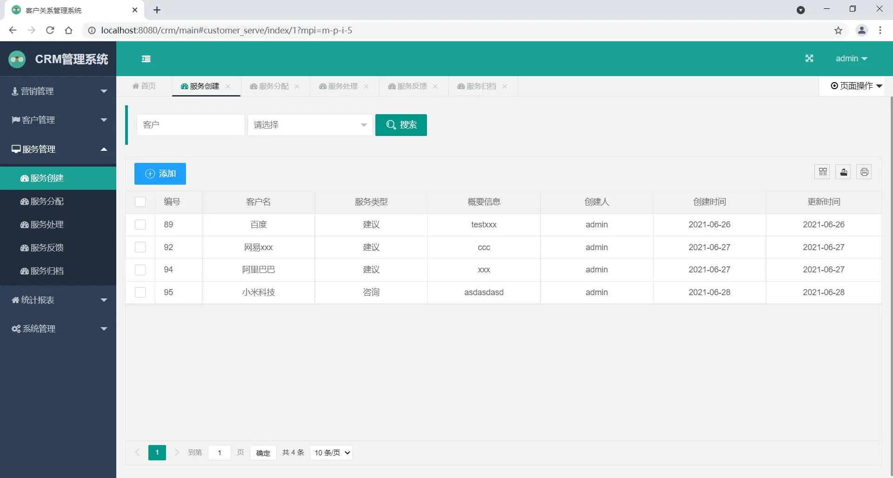

### 统计报表

*   客户贡献分析：对客户与公司产生的交易金额进行统计分析。 

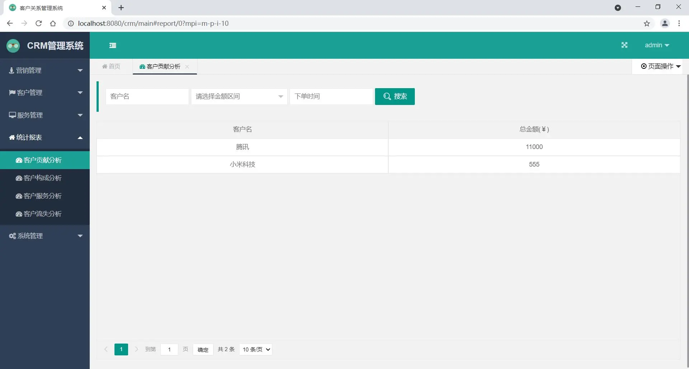

*   客户构成分析：采用echarts插件，对客户构成进行统计分析。 

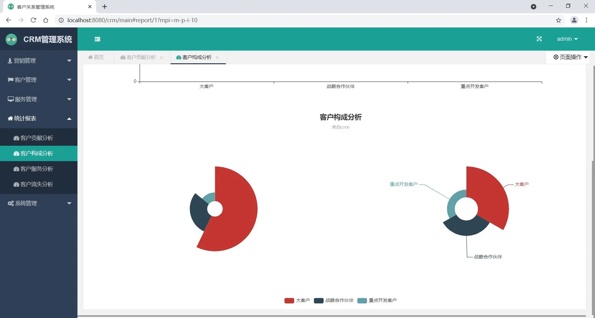

*   客户服务分析：采用echarts柱状图实现对客户服务类型以及数量进行统计分析。 

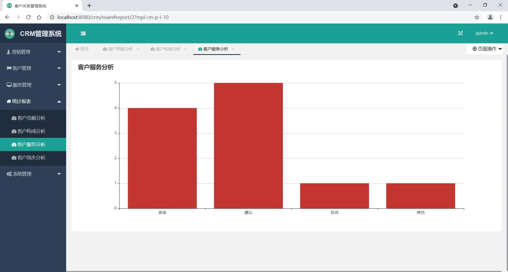

*   客户流失分析：对流失客户进行归档统计 

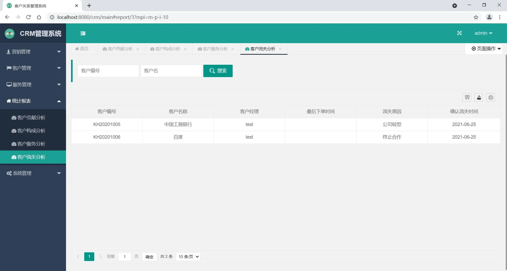

